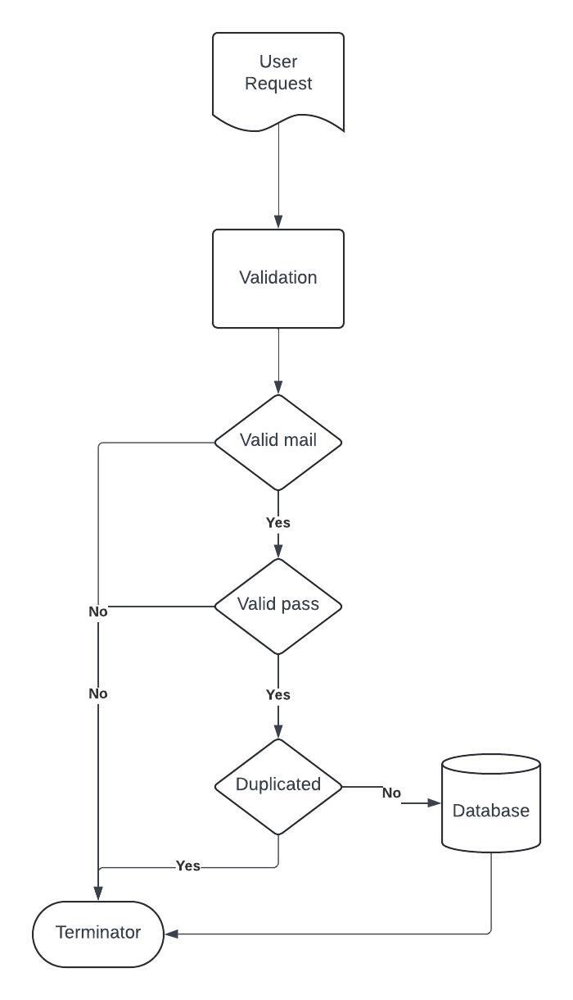

Este ejecicio consiste de un api para la creacion de usuarios.

Requerimientos: java 22

Despues de iniciar la aplicacion se puede usar el siguiente cURL para probarlo:

curl --location 'http://localhost:8080/user/create' \
--header 'token: d3425180-3599-41ba-8ae8-61c61219de7c' \
--header 'Content-Type: application/json' \
--data \
-raw '{
"name":"Juan Rodriguez",
"email":"juan@rodriguez.org",
"password":"hunter2",
"phones":[
{
"number":"1234567",
"citycode":"1",
"countrycode":"57"
}
]
}'

